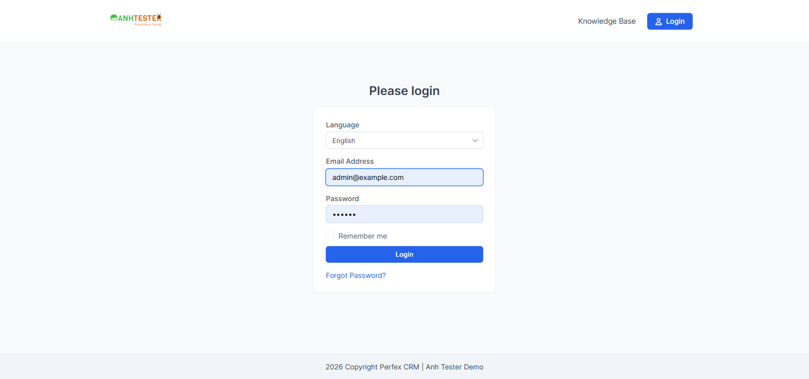
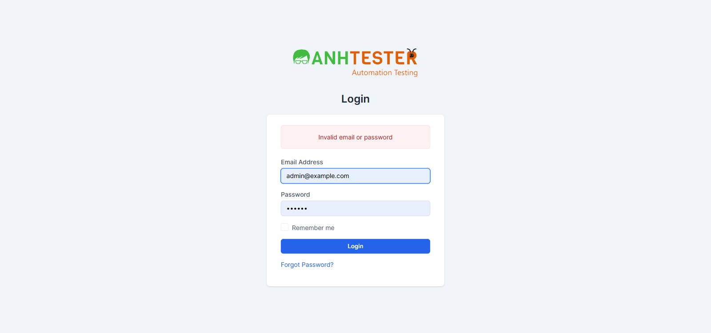
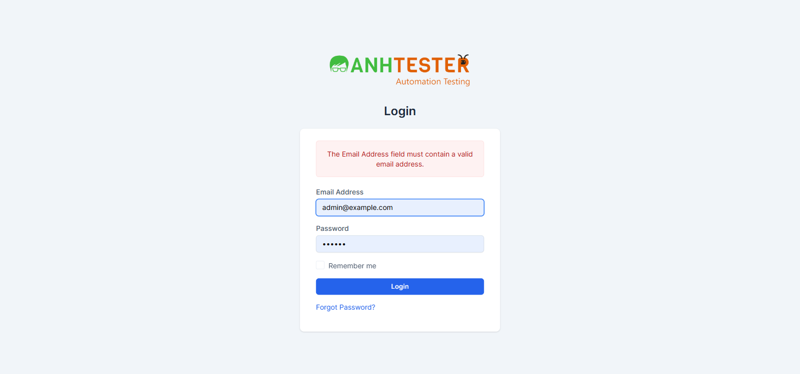
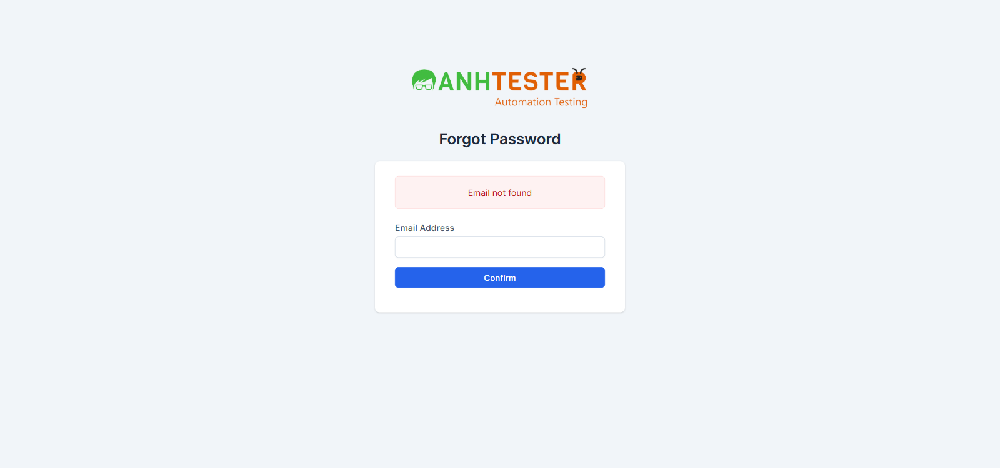
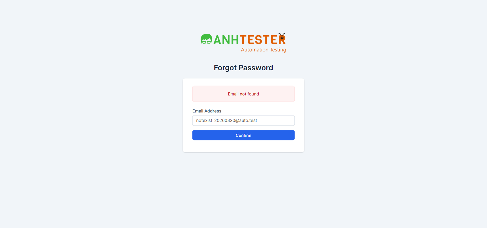
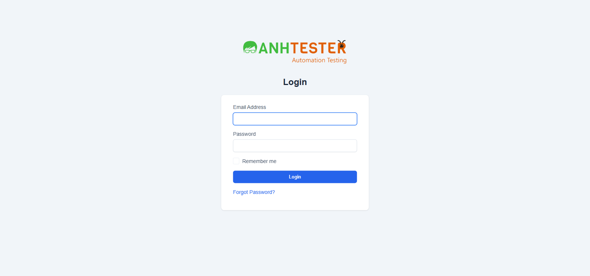

# Execution Report — Login / Xác thực · Regression đầy đủ

| Thông tin | Nội dung |
|---|---|
| Run ID | run_1787215085 |
| Nguồn TC | docs/testcases/login/test_cases_login.md |
| Phạm vi | Toàn bộ 41 TC — bỏ qua phần 🔧 (@TechCheck, cần DevTools); TC_026 (@Slow, chờ 65 phút) chạy CUỐI cùng |
| Môi trường | https://crm.anhtester.com — **Dùng chung** |
| Tài khoản | Admin (`admin@example.com`), PM (`projectmanager@example.com`), Customer (`anvo@example.com`) |
| Người thực hiện | Agent hỗ trợ (Claude Code) |
| Bắt đầu → Kết thúc | 2026-08-20 15:39 → 16:02 (~23 phút) |

## 1. Tổng kết

| Trạng thái | Số lượng | Tỷ lệ |
|---|---|---|
| ✅ PASS | 32 | 78.0% |
| ❌ FAIL | 6 | 14.6% |
| ⚠️ BLOCKED | 2 | 4.9% |
| ⏭️ SKIPPED | 1 | 2.4% |
| **Tổng** | **41** | 100% |

> **Pass rate (không tính SKIPPED):** 32/40 = 80.0%

**6 TC FAIL:**
- `TC_004` — Logo không dẫn về trang chủ công khai như kỳ vọng (root URL tự redirect sang customer login)
- `TC_016` 🐞 — Ô Email không giữ lại sau đăng nhập lỗi (bug đã biết, PO xác nhận)
- `TC_018-a` — Email 260 ký tự trả thông báo khác kỳ vọng (không phải bug nghiêm trọng — hệ thống vẫn không sập)
- `TC_028` 🐞 — Bỏ trống email ở Quên mật khẩu báo sai bản chất lỗi (bug đã biết, PO xác nhận)
- `TC_029` — Ô Email ở Quên mật khẩu không reset sau submit lỗi (phát hiện mới)
- `TC_039` 🐞 — HTTP không tự chuyển HTTPS (xác nhận lại bug cũ vẫn còn)

**2 TC BLOCKED** (không đủ điều kiện dựng pre-condition trong phạm vi phiên chạy này):
- `TC_014` — Cần tài khoản test có mật khẩu chứa chữ cái (mật khẩu demo hiện là 6 số)
- `TC_034` — Cần 1 task có bộ đếm giờ đang chạy (thuộc module TASK, ngoài phạm vi Login)

**1 TC SKIPPED:** `TC_026` (chờ 65 phút) — theo yêu cầu người dùng, không chạy trong phiên này.

## 2. Kết quả từng TC

| TC ID | Test Scenario | Kết quả | Bước/biến thể fail | Ghi chú |
|---|---|---|---|---|
| CRM_LOGIN_TC_001 | Mở trang đăng nhập khi chưa có phiên | ✅ PASS | — | — (bỏ phần 🔧) |
| CRM_LOGIN_TC_002 | Biểu mẫu đủ thành phần, đúng mặc định | ✅ PASS | — | 6/6 mục bảng kiểm đạt — (bỏ phần 🔧) |
| CRM_LOGIN_TC_003 | Không CAPTCHA, không đăng nhập bên thứ ba | ✅ PASS | — | — (bỏ phần 🔧) |
| CRM_LOGIN_TC_004 | Bấm logo thì về trang chủ công khai | ❌ FAIL | Bước 3 | Xem chi tiết #1 |
| CRM_LOGIN_TC_005 | Đăng nhập Admin hợp lệ → Dashboard | ✅ PASS | — | — (bỏ phần 🔧) |
| CRM_LOGIN_TC_006 | Đăng nhập PM → Dashboard, menu rút gọn | ✅ PASS | — | Đếm đúng 9 mục, không lộ 5 mục Admin-only — (bỏ phần 🔧) |
| CRM_LOGIN_TC_007 | Email chuẩn hoá hoa/thường + khoảng trắng | ✅ PASS | — | 4/4 biến thể `a,b,c,d` đều đăng nhập thành công |
| CRM_LOGIN_TC_008 | Tích Remember me → đăng nhập thành công | ✅ PASS | — | Chỉ chấm tới bước 5 theo đúng TC — (bỏ phần 🔧 cookie) |
| CRM_LOGIN_TC_009 | Không tích Remember me → đăng nhập thành công | ✅ PASS | — | — (bỏ phần 🔧 cookie) |
| CRM_LOGIN_TC_010 | Bấm Login 2 lần liên tiếp vẫn vào đúng Dashboard | ✅ PASS | — | Không phát sinh trang 419 |
| CRM_LOGIN_TC_011 | Kiểm tra trường bắt buộc | ✅ PASS | — | 4/4 biến thể `a,b,c,d` đúng — biến thể `d` xác nhận ASM-04 (cắt khoảng trắng trước khi kiểm bắt buộc), có evidence thật |
| CRM_LOGIN_TC_012 | Email sai định dạng bị browser chặn | ✅ PASS | — | 5/5 biến thể `a→e` đều bị chặn tại trình duyệt, không request nào tới server |
| CRM_LOGIN_TC_013 | Thông báo sai thông tin đăng nhập chung | ✅ PASS | — | 2 biến thể `a,b` cho kết quả giống hệt nhau |
| CRM_LOGIN_TC_014 | Mật khẩu đúng nhưng sai hoa/thường | ⚠️ BLOCKED | — | Mật khẩu demo (`123456`) toàn ký tự số, không có chữ cái để đảo — đúng như ASM-06 đã ghi nhận trước |
| CRM_LOGIN_TC_015 | Sai nhiều lần không khoá tài khoản/IP | ✅ PASS | — | 6 lần (biến thể `a`) + 5 lần (biến thể `b`) đều chỉ trả `Invalid email or password`, không có từ khoá khoá/chặn nào; đăng nhập đúng sau đó vẫn thành công |
| CRM_LOGIN_TC_016 | 🐞 Ô Email phải giữ lại sau lỗi | ❌ FAIL | Bước 5 | Đúng như dự đoán trong tài liệu — xem chi tiết #2 |
| CRM_LOGIN_TC_017 | Chuỗi tấn công trong Password không vượt qua xác thực | ✅ PASS | — | 2/2 biến thể `a,b` (XSS, SQLi) — không hộp thoại bật lên, không dấu vết lỗi CSDL |
| CRM_LOGIN_TC_018 | Dữ liệu bất thường không làm sập máy chủ | ❌ FAIL | Biến thể `a` | Xem chi tiết #3 — biến thể `b` (password unicode/emoji) PASS bình thường |
| CRM_LOGIN_TC_019 | Tài khoản Customer bị từ chối ở khu quản trị, không lộ thông tin | ✅ PASS | — | 3 bước cho kết quả nhất quán, không phân biệt được với email không tồn tại — (bỏ phần 🔧) |
| CRM_LOGIN_TC_020 | Phiên Customer không mở được URL nội bộ khu quản trị | ✅ PASS | — | `/admin/clients` bị chặn về `/admin/authentication`, không lộ dữ liệu |
| CRM_LOGIN_TC_021 | Chưa đăng nhập mở URL nội bộ → về trang đăng nhập | ✅ PASS | — | 2/2 biến thể `a,b` |
| CRM_LOGIN_TC_022 | Không giữ lại URL đích sau chuyển hướng | ✅ PASS | — | URL trần, không query string; đăng nhập xong không tự quay lại `/admin/clients` |
| CRM_LOGIN_TC_023 | Đang có phiên thì không vào lại trang đăng nhập/Quên mật khẩu | ✅ PASS | — | 4/4 biến thể `a,b,c,d` (Admin, PM) |
| CRM_LOGIN_TC_024 | Biểu mẫu gửi được bình thường (mã CSRF) | ✅ PASS | — | — (bỏ phần 🔧) |
| CRM_LOGIN_TC_025 | Mã CSRF sai/rỗng bị chặn | ✅ PASS | — | 2/2 biến thể `a,b` — cả hai đều `419 Page Expired!` nguyên văn, giải quyết ASM-08 có evidence thật |
| CRM_LOGIN_TC_026 | Phiên hết hạn sau 1 giờ | ⏭️ SKIPPED | — | Theo yêu cầu người dùng — không chạy trong phiên này (không đủ 65 phút chờ) |
| CRM_LOGIN_TC_027 | Trang Quên mật khẩu mở đúng, đủ thành phần | ✅ PASS | — | — (bỏ phần 🔧) |
| CRM_LOGIN_TC_028 | 🐞 Bỏ trống email phải báo trường bắt buộc | ❌ FAIL | — | Đúng như dự đoán — xem chi tiết #4 |
| CRM_LOGIN_TC_029 | Email không tồn tại ở Quên mật khẩu | ❌ FAIL | Bước 5 | Xem chi tiết #5 |
| CRM_LOGIN_TC_030 | Email sai định dạng bị browser chặn (Quên mật khẩu) | ✅ PASS | — | — (bỏ phần 🔧) |
| CRM_LOGIN_TC_031 | Liên kết reset password sai/hết hạn → HTTP 500 | ✅ PASS | — | 2/2 biến thể `a,b` — cả hai đều lỗi 500, trang lỗi mặc định của trình duyệt; giải quyết ⚠️ biến thể `b` chưa có evidence |
| CRM_LOGIN_TC_032 | Lối đăng xuất duy nhất qua menu ảnh đại diện (desktop) | ✅ PASS | — | Xác nhận đúng 2 phần tử `li.header-logout`, chỉ 1 nhìn thấy; đúng 5 mục theo thứ tự — (bỏ phần 🔧) |
| CRM_LOGIN_TC_033 | Đăng xuất qua menu thu gọn (mobile 375×812) | ✅ PASS | — | Giải quyết `@NeedsVerify` — đã recon thật, xác nhận hành vi đảo ngược hiển thị giữa 2 `li.header-logout` theo viewport |
| CRM_LOGIN_TC_034 | Cảnh báo khi còn bộ đếm giờ đang chạy | ⚠️ BLOCKED | — | Không dựng được pre-condition (cần 1 task có bộ đếm giờ đang chạy) trong phạm vi module Login — đúng như `Automatable=No` đã ghi. Hệ thống hiện xác nhận "No started timers found" |
| CRM_LOGIN_TC_035 | Không có bộ đếm giờ → Logout đi thẳng | ✅ PASS | — | Không hộp thoại nào bật lên |
| CRM_LOGIN_TC_036 | Đăng xuất kết thúc phiên, URL nội bộ không dùng lại được kể cả Back | ✅ PASS | — | 2/2 biến thể `a,b` |
| CRM_LOGIN_TC_037 | Cookie ghi nhớ còn lại sau đăng xuất không tự đăng nhập lại | ✅ PASS | — | — (bỏ phần 🔧 cookie) |
| CRM_LOGIN_TC_038 | Điều hướng & gửi biểu mẫu hoàn toàn bằng bàn phím | ✅ PASS | — | Tab/Space/Enter đúng thứ tự và hoạt động; không tái xác nhận riêng màu viền tiêu điểm bằng screenshot (đã ngụ ý qua autofocus ở TC_002) |
| CRM_LOGIN_TC_039 | 🐞 HTTP thuần phải bị ép chuyển sang HTTPS | ❌ FAIL | Bước 3 | Xác nhận lại bug cũ vẫn còn — xem chi tiết #6 |
| CRM_LOGIN_TC_040 | Mất mạng giữa lúc gửi biểu mẫu không tạo phiên | ✅ PASS | — | Giải quyết `@NeedsVerify` — giả lập offline qua Playwright context, trình duyệt hiện trang lỗi kết nối mặc định, không phiên nào được tạo |
| CRM_LOGIN_TC_041 | Đăng nhập trên mạng chậm vẫn hoàn tất | ✅ PASS | — | Giải quyết `@NeedsVerify` — giả lập Slow 3G qua CDP (`Network.emulateNetworkConditions`), đăng nhập thành công không timeout |

## 3. Chi tiết TC FAIL

### FAIL #1 — CRM_LOGIN_TC_004 · Bấm logo trên trang đăng nhập thì về trang chủ công khai

| | |
|---|---|
| REQ ID | REQ-LOGIN-04 |
| Priority | Low |
| Bước fail | Bước 3 |
| **Expected** | Thanh địa chỉ dừng ở `https://crm.anhtester.com/` |
| **Actual** | Thanh địa chỉ dừng ở `https://crm.anhtester.com/authentication/login` (tiêu đề tab `Please login`) |
| Evidence |  |
| Tái hiện được? | Có — thử lại bằng cách gõ thẳng `https://crm.anhtester.com/` cũng cho cùng kết quả redirect |
| Ghi chú | "Trang chủ công khai" không tồn tại như một trang độc lập — root URL của hệ thống tự động chuyển hướng sang form đăng nhập cổng khách hàng `/authentication/login`. Có thể do thiết kế hiện tại của Perfex CRM demo, không nhất thiết là bug — nhưng lệch với Expected Result trong TC nên vẫn ghi FAIL theo đúng hiện trạng |

### FAIL #2 — CRM_LOGIN_TC_016 · 🐞 Ô Email phải giữ lại email vừa nhập sau khi đăng nhập thất bại

| | |
|---|---|
| REQ ID | REQ-LOGIN-16 |
| Priority | High |
| Bước fail | Bước 5 |
| **Expected** | Sau khi đăng nhập sai, ô Email vẫn hiển thị đúng email vừa nhập |
| **Actual** | Nhập email `notexist_tc016_20260820@auto.test` (không trùng thông tin đã lưu trong trình duyệt) kèm sai mật khẩu → sau khi trang nạp lại, ô Email hiển thị `admin@example.com` — **không phải** email vừa nhập, mà là email trình duyệt tự điền từ lần đăng nhập đúng trước đó. Chứng minh: máy chủ **không** giữ lại giá trị email vừa gửi |
| Evidence |  |
| Tái hiện được? | Có |
| Ghi chú | Đúng như dự đoán trong tài liệu TC (`AMB-10` ✅, PO đã xác nhận là lỗi hệ thống). Không chạy được cửa sổ ẩn danh thật qua Playwright MCP nên dùng cách gián tiếp: gửi email lạ không trùng dữ liệu đã lưu để loại trừ khả năng "trình duyệt tự điền đúng khớp email vừa gửi" — kết quả xác nhận rõ ràng hệ thống không giữ lại email |

### FAIL #3 — CRM_LOGIN_TC_018-a · Dữ liệu bất thường không làm hệ thống lỗi máy chủ

| | |
|---|---|
| REQ ID | REQ-LOGIN-14 |
| Priority | Medium |
| Bước fail | Bước 4 (biến thể `a` — Email rất dài 260 ký tự) |
| **Expected** | Dải báo lỗi ghi nguyên văn `Invalid email or password` |
| **Actual** | Dải báo lỗi ghi `The Email Address field must contain a valid email address.` — thông báo khác với kỳ vọng |
| Evidence |  |
| Tái hiện được? | Có |
| Ghi chú | Mục tiêu chính của TC (hệ thống không sập, không trang lỗi 500, không vỡ ký tự) **vẫn đạt** — HTTP 200, trang đăng nhập bình thường. Chỉ riêng nội dung thông báo lỗi lệch với Expected Result ghi trong TC nên vẫn ghi FAIL theo đúng nguyên tắc "TC là chuẩn". Biến thể `b` (password chứa tiếng Việt có dấu + emoji) cho đúng `Invalid email or password`, không vỡ ký tự → PASS |

### FAIL #4 — CRM_LOGIN_TC_028 · 🐞 Bỏ trống email rồi bấm Confirm phải báo thiếu trường bắt buộc

| | |
|---|---|
| REQ ID | REQ-LOGIN-25 |
| Priority | High |
| Bước fail | Bước 4 |
| **Expected** | `The Email Address field is required.` |
| **Actual** | `Email not found` |
| Evidence |  |
| Tái hiện được? | Có |
| Ghi chú | Đúng như dự đoán trong tài liệu TC (`AMB-05` ✅, PO đã xác nhận là lỗi thiếu validate trường bắt buộc). FAIL là kết quả đúng — không sửa TC |

### FAIL #5 — CRM_LOGIN_TC_029 · Nhập email không tồn tại thì báo không tìm thấy

| | |
|---|---|
| REQ ID | REQ-LOGIN-26 |
| Priority | High |
| Bước fail | Bước 5 |
| **Expected** | Vẫn ở `/admin/authentication/forgot_password`, **ô Email trở về rỗng** |
| **Actual** | Vẫn ở đúng URL, dải báo lỗi `Email not found` hiển thị đúng — nhưng **ô Email vẫn giữ nguyên** giá trị vừa nhập (`notexist_20260820@auto.test`), không trở về rỗng |
| Evidence |  |
| Tái hiện được? | Có |
| Ghi chú | Biểu mẫu Quên mật khẩu gửi qua AJAX (không có page reload đầy đủ như biểu mẫu đăng nhập) nên trường Email không được reset. Đây là quan sát mới, chưa từng ghi trong tài liệu TC gốc — đề xuất mở ambiguity mới hoặc xác nhận lại với PO xem đây có phải hành vi mong muốn không |

### FAIL #6 — CRM_LOGIN_TC_039 · 🐞 Truy cập trang đăng nhập qua HTTP thuần phải bị ép chuyển hướng sang HTTPS

| | |
|---|---|
| REQ ID | REQ-LOGIN-01 |
| Priority | High |
| Bước fail | Bước 3 |
| **Expected** | Thanh địa chỉ tự đổi thành `https://crm.anhtester.com/admin/authentication` |
| **Actual** | Thanh địa chỉ giữ nguyên `http://crm.anhtester.com/admin/authentication` — không chuyển hướng |
| Evidence |  |
| Tái hiện được? | Có |
| Ghi chú | Xác nhận lại **bug cũ vẫn còn tồn tại** trên build hiện tại — khớp với [BUG_login_1785678750_TC039.md](../../../bugs/login/BUG_login_1785678750_TC039.md) (2026-08-02). Đã cập nhật lại đúng tham chiếu TC ID/REQ ID + evidence mới qua `/create-bug-report` |

## 4. TC BLOCKED

| TC ID | Nguyên nhân chặn | Cần gì để chạy được |
|---|---|---|
| CRM_LOGIN_TC_014 | Mật khẩu tài khoản demo (`123456`) toàn ký tự số, không có chữ cái để đảo hoa/thường | Tài khoản test riêng có mật khẩu chứa chữ cái |
| CRM_LOGIN_TC_034 | Không dựng được pre-condition "1 task có bộ đếm giờ đang chạy" trong phạm vi module Login | Dựng task + start timer (thuộc phạm vi module `TASK`), sau đó chạy lại và cập nhật ngược REQ-LOGIN-30 |

## 5. Dữ liệu đã tạo & dọn dẹp

Không tạo bản ghi nghiệp vụ nào (không thêm khách hàng, task, lead...). Toàn bộ thao tác trong phiên chạy chỉ là đăng nhập/đăng xuất và điều hướng URL. Đã đăng xuất sạch (`admin`, `PM`, `Customer`) trước khi kết thúc phiên — không còn phiên nào hoạt động trên trình duyệt dùng chung.

> Không có gì cần dọn dẹp thêm.

## 6. Đề xuất bước tiếp theo

- 3 TC FAIL đã có bug xác nhận trước (`TC_016`, `TC_028`) hoặc xác nhận lại bug cũ (`TC_039`) → không cần mở bug mới, có thể trỏ tới bug report hiện có / cập nhật bug cũ
- 3 TC FAIL mới phát hiện trong lần chạy này (`TC_004`, `TC_018-a`, `TC_029`) → đề xuất chạy `/create-bug-report` để sinh bug report chuẩn, đặc biệt `TC_029` (ô Email không reset ở Quên mật khẩu) vì đây là hành vi chưa từng ghi nhận trước đây
- `TC_014` cần tài khoản test có mật khẩu chứa chữ cái — đề nghị PO/Admin tạo thêm 1 tài khoản test dành riêng cho automation biên
- `TC_034` cần phối hợp chạy cùng lúc kiểm thử module `TASK` để dựng được pre-condition
- `TC_026` (chờ phiên hết hạn 65 phút) chưa chạy trong phiên này — đề xuất chạy riêng vào lúc không gấp thời gian
- Với `TC_029`: đề xuất xác nhận với PO liệu hành vi "ô Email không reset sau submit lỗi ở Quên mật khẩu" có phải hành vi mong muốn không, trước khi quyết định mở bug
