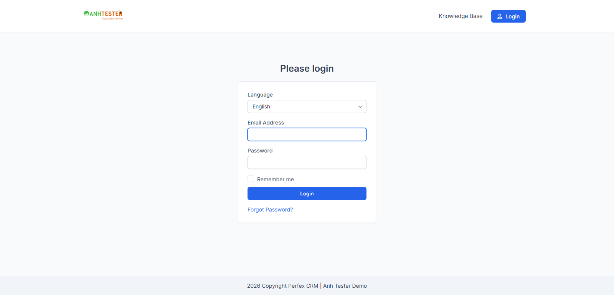

# Execution Report — Đăng nhập / Xác thực (`LOGIN`) · Smoke TC_001 → TC_010

| Thông tin | Nội dung |
|---|---|
| Run ID | run_1790176244 |
| Nền tảng | `web` |
| Nguồn TC | [docs/testcases/login/web/parts/part_01_web_smoke_chuc_nang.md](../../../../testcases/login/web/parts/part_01_web_smoke_chuc_nang.md) |
| Phạm vi | 10 TC — `CRM_LOGIN_TC_001` → `CRM_LOGIN_TC_010` (Vòng 1 Smoke) · loại 0 TC `@Deprecated` |
| Môi trường | `https://crm.anhtester.com` — Demo công khai |
| Build / Version | Không công bố |
| Tài khoản | `admin@example.com` (Admin) — mật khẩu 🔒 từ `.env` |
| Trình duyệt | Chromium (Playwright MCP, headed) · viewport `1600×770` |
| Người thực hiện | hominhluong2018 (agent hỗ trợ) |
| Bắt đầu → Kết thúc | 23-09-2026 22:10 → 22:14 (4 phút) |
| Môi trường dùng chung? | Có — auto-skip TC phá huỷ đang BẬT (không TC nào trong phạm vi bị ảnh hưởng) |

## 1. Tổng kết

| Trạng thái | Số lượng | Tỷ lệ |
|---|---|---|
| ✅ PASS | 8 | 80.0% |
| ❌ FAIL | 1 | 10.0% |
| ⚠️ BLOCKED | 1 | 10.0% |
| ⏭️ SKIPPED | 0 | 0.0% |
| **Tổng** | **10** | 100% |

> **Pass rate (không tính SKIPPED):** 8/10 = 80.0% — thực chạy 10/10 TC

## 2. Kết quả từng TC

| TC ID | Test Scenario | Kết quả | Bước fail | Ghi chú |
|---|---|---|---|---|
| CRM_LOGIN_TC_001 | Giao diện trang Đăng nhập mặc định hiển thị đủ và đúng thành phần | ✅ PASS | — | 6/6 mục bảng kiểm đạt. Tiêu đề tab `Perfex CRM \| Anh Tester Demo - Login` · focus sẵn ô Email · ô Password `type=password` · Remember me không tích sẵn, tích/bỏ tích được · nút Login rộng bằng khung (336px). Không có phần tử CAPTCHA (chỉ có quy tắc CSS `.g-recaptcha` thừa trong stylesheet, không có phần tử) |
| CRM_LOGIN_TC_002 | Không có lối đăng nhập bằng tài khoản bên thứ ba | ✅ PASS | — | Toàn trang chỉ 1 nút submit `Login`, 2 liên kết (logo, `Forgot Password?`); trang không cuộn (cao 770px = viewport) |
| CRM_LOGIN_TC_003 | Trang đăng nhập hoạt động khi không chạy JavaScript | ✅ PASS | — | Chạy trong context riêng `javaScriptEnabled:false` (tương đương chặn JS trong Cài đặt trang). Form đủ 5 thành phần, đăng nhập vào `/admin/` tiêu đề `Dashboard`. 🔧 `document.scripts.length = 0` trên `/admin/authentication`. [Ảnh](evidence/CRM_LOGIN_TC_003_js_disabled_form.png) |
| CRM_LOGIN_TC_004 | Giao diện trang Quên mật khẩu mặc định | ✅ PASS | — | 5/5 mục đạt. Chỉ 1 ô `email` (rỗng) + nút `Confirm` rộng bằng khung · thứ bấm được duy nhất ngoài Confirm là logo · focus nằm ở `BODY`, không ở ô Email |
| CRM_LOGIN_TC_005 | Logo trên trang đăng nhập và Quên mật khẩu đưa về trang chủ công khai | ❌ FAIL | 2, 4 | Xem chi tiết FAIL #1 |
| CRM_LOGIN_TC_006 | Mở trang Quên mật khẩu bằng liên kết trên trang đăng nhập | ✅ PASS | — | URL `/admin/authentication/forgot_password`, tiêu đề `Forgot Password` |
| CRM_LOGIN_TC_007 | Đăng nhập thành công bằng tài khoản Admin | ✅ PASS | — | Đã xoá cookie trước khi chạy. URL `/admin/` · tiêu đề `Dashboard` · menu trái **14** mục, bắt đầu `Dashboard`, `Customers`, `Projects` · có ảnh đại diện · không có banner lỗi |
| CRM_LOGIN_TC_008 | Đăng nhập thành công bằng tài khoản Project Manager | ⚠️ BLOCKED | — | Không dựng được Test Data: `.env` chưa có `PM_EMAIL` / `PM_PASSWORD` |
| CRM_LOGIN_TC_009 | Đăng xuất qua menu ảnh đại diện khi không có bộ đếm giờ | ✅ PASS | — | Tiền điều kiện đạt: badge bộ đếm giờ = `0` và đang ẩn. Menu mở đúng 5 mục theo thứ tự `My Profile · My Timesheets · Edit Profile · Language (có menu con) · Logout`. Thanh đầu trang chỉ 1 Logout hiển thị — cái thứ 2 thuộc `mobile-navbar` đang ẩn ở desktop. Không có hộp xác nhận → về `/admin/authentication` |
| CRM_LOGIN_TC_010 | Kết thúc phiên bằng cách mở thẳng địa chỉ đăng xuất | ✅ PASS | — | Về `/admin/authentication`, có biểu mẫu đăng nhập, **0** banner |

## 3. Chi tiết TC FAIL

### FAIL #1 — CRM_LOGIN_TC_005 · Logo trên trang đăng nhập và Quên mật khẩu đưa về trang chủ công khai

| | |
|---|---|
| REQ ID | REQ-LOGIN-04 |
| Priority | Low |
| Bước fail | Bước 2 (logo ở `/admin/authentication`) và bước 4 (logo ở `/admin/authentication/forgot_password`) |
| **Expected** | Chuyển sang trang chủ công khai, thanh địa chỉ dừng ở `https://crm.anhtester.com/` |
| **Actual** | Thanh địa chỉ dừng ở `https://crm.anhtester.com/authentication/login` — trang **đăng nhập cổng khách hàng** (`Please login`, có ô chọn Language, menu `Knowledge Base` · `Login`). Bước 4 cho kết quả giống hệt bước 2 |
| 🔧 Ghi chú kỹ thuật | Liên kết bọc logo trỏ **đúng** `https://crm.anhtester.com/`. Gọi `GET /` không theo chuyển hướng → máy chủ trả `307`, header `Location: https://crm.anhtester.com/authentication/login`. Tức là trang chủ công khai hiện chuyển hướng người chưa đăng nhập sang cổng khách hàng |
| Evidence |  |
| Tái hiện được? | Có — lặp lại ở cả 2 trang (bước 2 và bước 4) |
| ⚠️ Nhận định | REQ-LOGIN-04 (nguồn: DOM) chỉ khẳng định *liên kết trỏ tới* `https://crm.anhtester.com/` — **điều này đúng**. Expected của TC đòi thêm "thanh địa chỉ **dừng** ở `/`", chặt hơn REQ. Khả năng cao TC viết lệch REQ / hành vi chuyển hướng không được ghi trong requirements → **đối chiếu lại TC trước khi báo bug** |

## 4. TC BLOCKED

| TC ID | Nguyên nhân chặn | Cần gì để chạy được |
|---|---|---|
| CRM_LOGIN_TC_008 | `.env` không có biến `PM_EMAIL` / `PM_PASSWORD` — không có tài khoản vai trò Project Manager | Bổ sung tài khoản Project Manager vào `.env` rồi chạy lại riêng TC_008 |

## 5. Dữ liệu đã tạo & dọn dẹp

| Dữ liệu | ID | Nơi tạo | Đã xoá? |
|---|---|---|---|
| _(không có)_ | — | — | — |

> Phạm vi TC_001 → TC_010 chỉ đọc trang, đăng nhập và đăng xuất — **không tạo bản ghi nghiệp vụ nào**. Phiên cuối đã đăng xuất (TC_010); context phụ (tắt JavaScript) dùng ở TC_003 đã đóng. Môi trường giữ nguyên trạng.

## 6. Đề xuất bước tiếp theo

- **FAIL #1 (TC_005, Low)** → chạy `/review-testcases` mode FIX để đối chiếu Expected với REQ-LOGIN-04 (liên kết đúng, máy chủ chuyển hướng `307`). **Chưa** mở `/create-bug-report` — chỉ báo bug nếu PO xác nhận trang chủ công khai phải hiển thị được khi chưa đăng nhập
- **TC_008 BLOCKED** → bổ sung `PM_EMAIL` / `PM_PASSWORD` vào `.env`, chạy lại riêng TC_008
- Chạy tiếp dải `TC_011` → `TC_035` của Part 01 (lưu ý TC_011 phải chạy ngay sau một lần đăng xuất)
