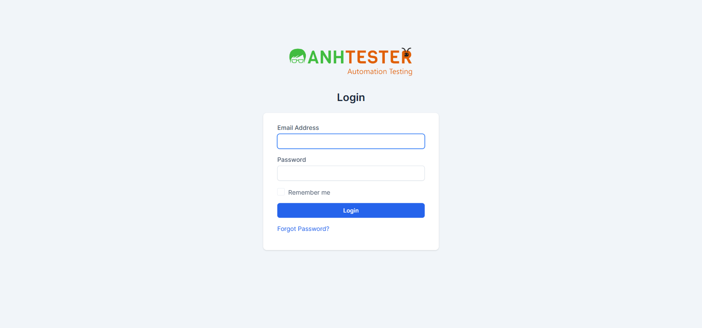
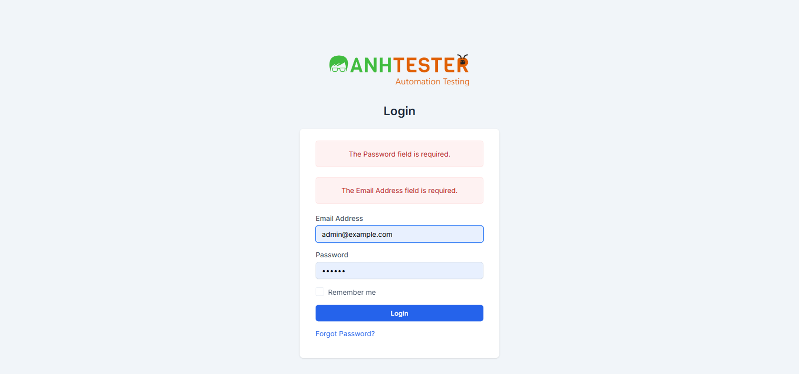
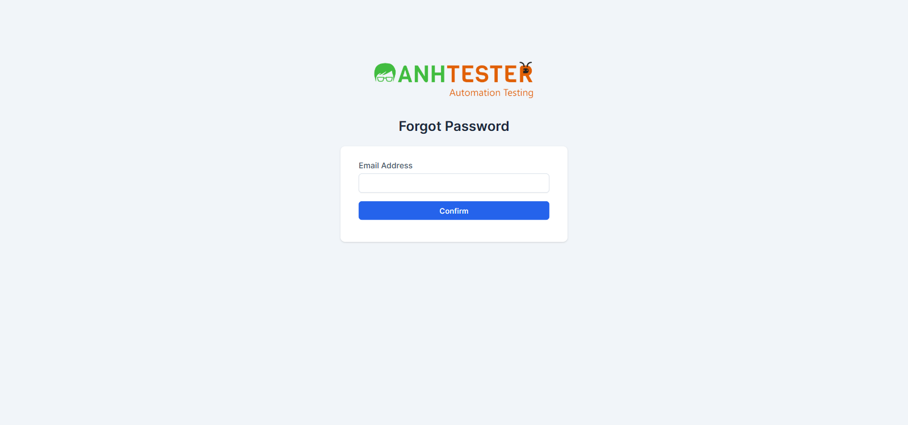
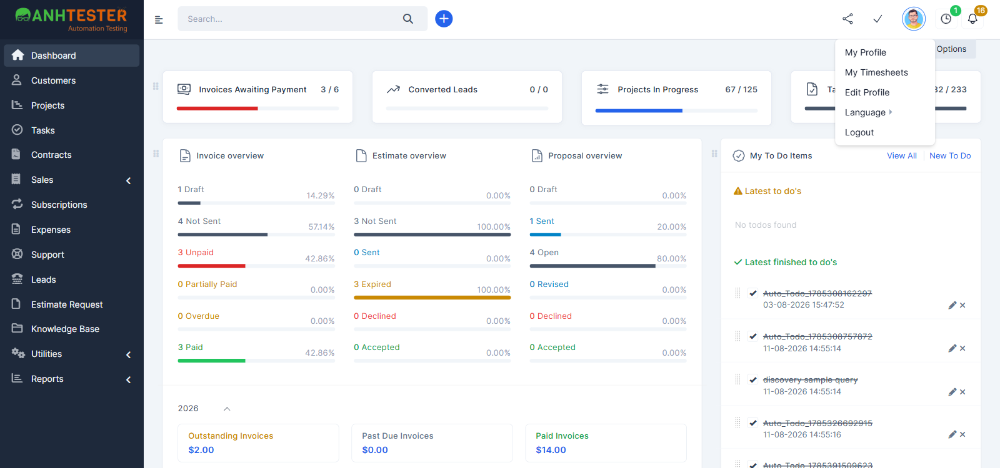

# Hướng dẫn sử dụng — Perfex CRM (Anh Tester Demo) · Đăng nhập & Đăng xuất

| | |
|---|---|
| Phiên bản tài liệu | v1.0 |
| Áp dụng cho phiên bản phần mềm | Perfex CRM — Anh Tester Demo, trạng thái khảo sát ngày **2026-08-18** |
| Đối tượng đọc | **Nhân viên nội bộ** — vai trò `Admin` và `Project Manager` |
| Ngày cập nhật | 2026-09-09 |
| Cấu trúc tài liệu | Biên soạn theo cấu trúc ISO/IEC/IEEE 26514 |
| Trạng thái | 🟨 Bản **nội bộ** — mục 6 phải gỡ trước khi phát hành ra ngoài |

---

## 1. Trước khi bắt đầu

- **Bạn cần có:** tài khoản nhân viên (vai trò `Admin` hoặc `Project Manager`) do quản trị hệ thống cấp
- **Trình duyệt:** Google Chrome trên máy tính. Giao diện đã kiểm trên màn hình rộng từ 1600 điểm ảnh trở lên
- **Địa chỉ đăng nhập:** `<địa chỉ hệ thống>/admin/authentication` — quản trị hệ thống cung cấp cho bạn
- Giao diện hiển thị **tiếng Anh**. Bảng đối chiếu nhãn màn hình sang tiếng Việt ở [mục 5](#5-bảng-đối-chiếu-nhãn-màn-hình)

> ❗ **THẬN TRỌNG:** Nếu bạn là **khách hàng** (không phải nhân viên), đây **không** phải cổng đăng nhập của bạn. Tài khoản khách hàng dùng ở địa chỉ `/login`, và nhập vào trang này sẽ luôn báo lỗi sai thông tin — xem [mục 4](#4-câu-hỏi-thường-gặp).

---

## 2. Bạn muốn làm gì?

| Tôi muốn… | Xem mục |
|---|---|
| Đăng nhập vào hệ thống | [3.1](#31-đăng-nhập-vào-hệ-thống) |
| Lấy lại mật khẩu khi quên | [3.2](#32-lấy-lại-mật-khẩu-khi-quên) |
| Đăng xuất khỏi hệ thống | [3.3](#33-đăng-xuất-khỏi-hệ-thống) |
| Hiểu vì sao bị đăng xuất giữa chừng, vì sao ô "Remember me" không có tác dụng | [4](#4-câu-hỏi-thường-gặp) |

---

## 3. Các thao tác

### 3.1 Đăng nhập vào hệ thống

**Khi nào dùng:** mỗi lần bắt đầu phiên làm việc, và mỗi khi hệ thống đưa bạn về trang đăng nhập.

1. Mở trình duyệt, vào địa chỉ `<địa chỉ hệ thống>/admin/authentication`.
   Trang hiện tiêu đề **Login**, con trỏ nằm sẵn trong ô **Email Address** — bạn gõ được ngay, không cần nhấn vào ô.

   

2. Nhập email công việc của bạn vào ô **Email Address**.
   💡 Không cần để ý chữ hoa chữ thường, và nếu lỡ dính khoảng trắng ở đầu hoặc cuối thì hệ thống vẫn nhận.
3. Nhập mật khẩu vào ô **Password**. Ký tự hiện dạng chấm tròn; màn hình này **không có** nút xem lại mật khẩu vừa gõ.
4. Nhấn nút **Login**.
   Hệ thống mở màn hình **Dashboard**: thanh bên trái hiện danh sách **Dashboard · Customers · Projects · Tasks · Contracts · Sales …**, thanh trên cùng có ô **Search…** và ảnh đại diện của bạn ở góc phải.

💡 Bạn **không cần** tích ô **Remember me** — ô này hiện không có tác dụng, xem [mục 4](#4-câu-hỏi-thường-gặp).

**Nếu không được:**

| Bạn thấy | Nghĩa là | Làm gì |
|---|---|---|
| Khung đỏ **`Invalid email or password`** | Sai email hoặc sai mật khẩu. Hệ thống cố tình không cho biết sai ở đâu | Gõ lại cả hai ô. Ô Email bị xoá trắng sau mỗi lần lỗi nên phải nhập lại từ đầu. Vẫn không được → [lấy lại mật khẩu](#32-lấy-lại-mật-khẩu-khi-quên) |
| Hai khung đỏ **`The Password field is required.`** và **`The Email Address field is required.`** | Bạn nhấn **Login** khi cả hai ô còn trống | Điền đủ hai ô rồi nhấn **Login** lại |
| Một khung đỏ **`The Email Address field is required.`** | Chỉ thiếu ô **Email Address** | Điền email |
| Một khung đỏ **`The Password field is required.`** | Chỉ thiếu ô **Password** | Điền mật khẩu |
| Bong bóng vàng của trình duyệt: *"Please include an '@' in the email address"* | Email thiếu ký tự `@` — trình duyệt chặn trước, chưa gửi đi đâu cả | Sửa lại email cho đủ dạng `ten@congty.com` |
| Trang trắng ghi **`419 Page Expired!`** | Trang đăng nhập đã mở quá lâu trước khi bạn nhấn **Login** | Quay lại trang trước, tải lại trang (F5), rồi đăng nhập lại |

💡 Nhập sai nhiều lần **không** làm khoá tài khoản — cứ thử lại khi nhớ ra mật khẩu.

---

### 3.2 Lấy lại mật khẩu khi quên

**Khi nào dùng:** bạn không nhớ mật khẩu và cần hệ thống gửi liên kết đặt lại.

> ⚠️ **CẢNH BÁO:** Trang **Forgot Password** **không có** nút hay liên kết quay lại trang đăng nhập. Muốn quay về, bạn phải tự sửa địa chỉ trên thanh trình duyệt thành `<địa chỉ hệ thống>/admin/authentication`, hoặc nhấn nút Back. Hãy nhớ điều này trước khi rời trang đăng nhập.

1. Ở trang đăng nhập, nhấn liên kết **Forgot Password?** nằm ngay dưới nút **Login**.
2. Trang **Forgot Password** mở ra với một ô **Email Address** và nút **Confirm**.

   

3. Nhập email công việc của bạn.
4. Nhấn **Confirm**.
   Nếu email có trong hệ thống, hệ thống gửi liên kết đặt lại mật khẩu tới hộp thư đó. ⚠️ *Xem [mục 6](#6-vùng-chưa-xác-minh-nội-bộ) — bước sau khi nhận email chưa được kiểm chứng.*

**Nếu không được:**

| Bạn thấy | Nghĩa là | Làm gì |
|---|---|---|
| Khung đỏ **`Email not found`** sau khi nhập email | Email vừa nhập không có trong hệ thống | Kiểm tra lại chính tả. Đúng rồi mà vẫn báo → liên hệ quản trị hệ thống, có thể tài khoản dùng email khác |
| Khung đỏ **`Email not found`** khi bạn **chưa nhập gì** | ⚠️ Đây là điểm gây nhầm lẫn đã biết: bỏ trống ô email cũng cho ra đúng thông báo này, **không** phải email của bạn có vấn đề | Nhập email vào ô rồi nhấn **Confirm** lại |
| Trang trắng hoặc trang báo lỗi khi mở liên kết trong email | Liên kết đặt lại đã hết hạn hoặc bị sửa đổi (ví dụ copy thiếu ký tự) | Quay lại bước 1 để xin liên kết mới. Copy nguyên vẹn địa chỉ trong email, đừng gõ tay |

---

### 3.3 Đăng xuất khỏi hệ thống

**Khi nào dùng:** kết thúc phiên làm việc, hoặc trước khi rời khỏi máy tính dùng chung.

1. Nhấn **ảnh đại diện** của bạn ở góc trên bên phải màn hình.
2. Menu thả xuống mở ra gồm **My Profile · My Timesheets · Edit Profile · Language · Logout**. Nhấn **Logout** — mục cuối cùng.

   

3. Hệ thống kết thúc phiên và đưa bạn về trang **Login**. Không có thông báo xác nhận nào — về được trang đăng nhập nghĩa là đã đăng xuất xong.

💡 Sau khi đăng xuất, nhấn nút **Back** của trình duyệt sẽ **không** xem lại được nội dung bạn vừa mở — hệ thống không lưu đệm các trang này. Đây là hành vi đúng.

**Nếu không được:**

| Bạn thấy | Nghĩa là | Làm gì |
|---|---|---|
| Hộp thoại **`Started tasks timers found!`** hiện lên | Bạn còn bộ đếm giờ công việc đang chạy, hệ thống hỏi lại trước khi đăng xuất | Đọc kỹ nội dung rồi chọn. ⚠️ *Xem [mục 6](#6-vùng-chưa-xác-minh-nội-bộ) — hộp thoại này chưa được kiểm chứng thực tế* |

---

## 4. Câu hỏi thường gặp

**Tôi tích ô "Remember me" rồi mà lần sau vẫn phải đăng nhập lại?**
Đúng vậy, và **bạn không làm sai gì cả**. Tính năng ghi nhớ đăng nhập hiện **không hoạt động** — đội phát triển đã xác nhận ngày 2026-08-18. Ô này vẫn hiển thị trên màn hình nhưng tích hay không, lần sau bạn vẫn phải nhập lại email và mật khẩu.

**Đang làm việc thì bị đưa về trang đăng nhập?**
Mỗi phiên đăng nhập kéo dài **1 giờ**. Hết thời gian đó, mọi trang trong hệ thống đều đưa bạn về trang đăng nhập. Đăng nhập lại là làm việc tiếp được.
💡 Nếu đang điền một biểu mẫu dài, hãy lưu lại sớm — nội dung chưa lưu sẽ mất khi phiên hết hạn.

**Nhập sai mật khẩu nhiều lần có bị khoá tài khoản không?**
Không. Hệ thống không khoá tài khoản theo số lần nhập sai. Nhớ ra mật khẩu là đăng nhập được ngay.

**Tôi là khách hàng, đăng nhập ở đây báo `Invalid email or password` dù mật khẩu đúng?**
Hệ thống có **hai cổng đăng nhập tách biệt**. Trang này (`/admin/authentication`) chỉ dành cho nhân viên. Tài khoản khách hàng đăng nhập ở `/login`. Thông báo lỗi cố tình giống hệt trường hợp sai mật khẩu, nên nhìn thông báo sẽ không phân biệt được — hãy kiểm tra lại bạn đang mở đúng địa chỉ nào.

**Tôi mở thẳng một địa chỉ trong hệ thống nhưng bị đưa về trang đăng nhập?**
Đó là hành vi đúng khi bạn chưa đăng nhập hoặc phiên đã hết hạn. Lưu ý: sau khi đăng nhập, hệ thống đưa bạn về **Dashboard** chứ **không** quay lại trang bạn định mở — bạn cần mở lại địa chỉ đó.

**Sau khi báo lỗi đăng nhập, ô Email bị xoá trắng?**
Đây là hiện trạng đã biết của hệ thống: mỗi lần đăng nhập lỗi, bạn phải gõ lại cả email lẫn mật khẩu. Nếu ô email trông như vẫn còn chữ thì đó là trình duyệt tự điền, không phải hệ thống giữ lại.

---

## 5. Bảng đối chiếu nhãn màn hình

Giao diện hiển thị tiếng Anh; bảng này để bạn dò nhanh.

| Nhãn trên màn hình | Nghĩa |
|---|---|
| **Login** | Đăng nhập — vừa là tiêu đề trang, vừa là tên nút |
| **Email Address** | Địa chỉ email |
| **Password** | Mật khẩu |
| **Remember me** | Ghi nhớ đăng nhập *(hiện không có tác dụng — xem mục 4)* |
| **Forgot Password?** | Quên mật khẩu — liên kết dưới nút Login |
| **Confirm** | Xác nhận — nút gửi ở trang Quên mật khẩu |
| **Logout** | Đăng xuất |
| **Dashboard** | Màn hình tổng quan sau khi đăng nhập |
| `Invalid email or password` | Sai email hoặc mật khẩu |
| `The … field is required.` | Trường … còn bỏ trống |
| `Email not found` | Không tìm thấy email |
| `419 Page Expired!` | Trang đã hết hạn, cần tải lại |

---

## 6. Vùng chưa xác minh (nội bộ)

> 🚫 **Gỡ toàn bộ mục này trước khi phát hành tài liệu ra ngoài.** Đây là ghi chú nội bộ, không dành cho người dùng cuối.

| Nội dung | Vì sao chưa xác minh | Ảnh hưởng tới tài liệu |
|---|---|---|
| Nhận email đặt lại mật khẩu và đặt mật khẩu mới (mục 3.2 bước 4) | `REQ-LOGIN-27` ⚪ — PO chốt bỏ qua luồng gửi mail ngày 2026-08-18 (`AMB-04`), không có ảnh nào chụp được email hay màn hình đặt mật khẩu mới | Bước 4 mô tả kỳ vọng, **chưa chạy thật**. Không viết được các bước sau khi mở email |
| Hộp thoại `Started tasks timers found!` khi đăng xuất lúc còn bộ đếm giờ (mục 3.3) | `REQ-LOGIN-30` — mới đọc được ở mã nguồn, việc kiểm chứng thực tế đã chuyển sang module `TASK` (`AMB-14`) | Không mô tả được các nút trong hộp thoại và hậu quả từng lựa chọn |
| Đăng xuất trên điện thoại / màn hình nhỏ | `REQ-LOGIN-29` — nhánh mobile chưa recon, chưa có số liệu nào | Tài liệu chỉ đúng cho máy tính màn hình rộng |
| Thời hạn phiên 1 giờ tính theo cách nào (mục 4) | `AMB-19` 🟡 còn treo — chưa rõ là 1 giờ không hoạt động hay 1 giờ kể từ lúc đăng nhập | Câu trả lời trong FAQ nói chung chung "kéo dài 1 giờ", chưa nói được chính xác cách tính |

**Nguồn ảnh:** 4 ảnh trong `images/` sao chép từ `docs/requirements/login/evidence/` (đợt khảo sát 2026-08-18), đổi tên theo việc.

> ⚠️ Ảnh `dang-xuat-menu-anh-dai-dien.png` chụp màn hình Dashboard nên có kèm số liệu nghiệp vụ của môi trường demo (số tiền, danh sách việc cần làm). Chấp nhận được với bản nội bộ. **Muốn phát hành ra ngoài thì chụp lại ảnh này** trên môi trường dữ liệu mẫu, hoặc cắt chỉ lấy vùng menu ảnh đại diện.

---

## 7. Nhật ký tài liệu

| Ngày | Phiên bản | Thay đổi |
|---|---|---|
| 2026-09-09 | v1.0 | Bản đầu tiên — 3 thủ tục, 6 câu hỏi thường gặp, 4 ảnh. Sinh bằng `/generate-user-guide` Mode DOC từ `requirements_login.md` (43 REQ) và 9 ảnh evidence |
